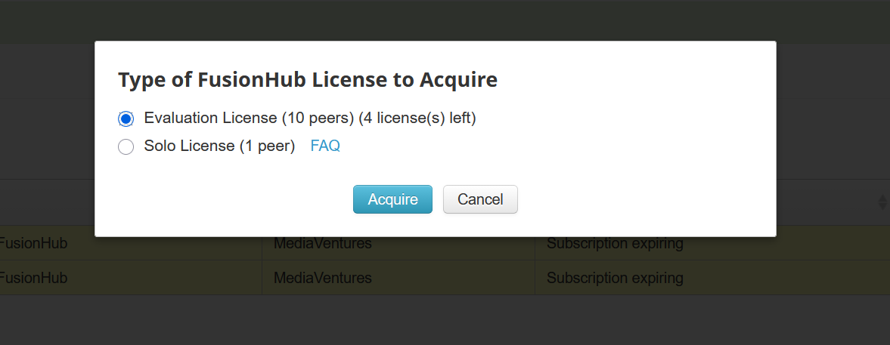
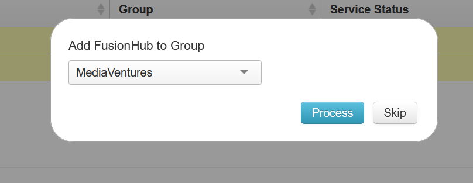
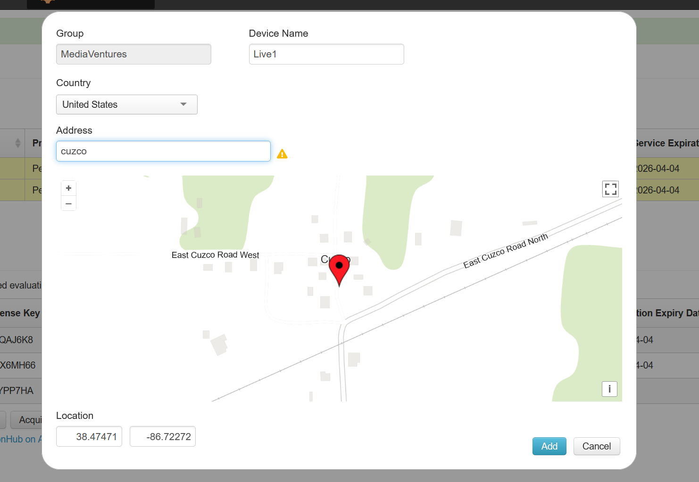
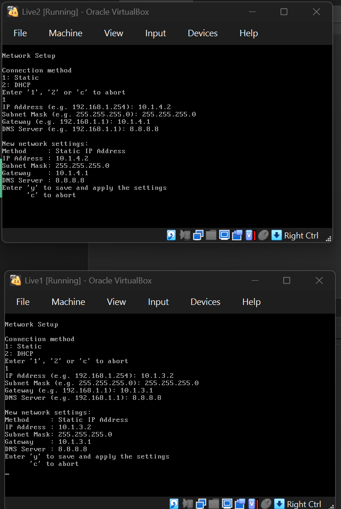
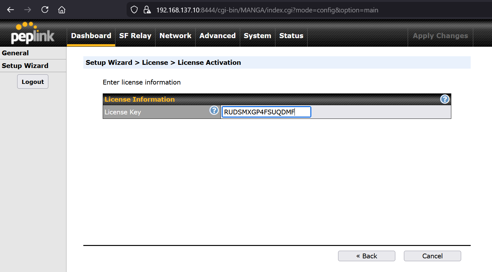
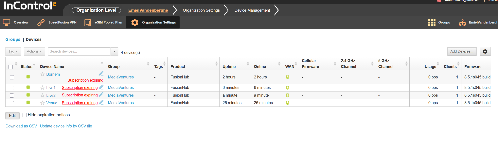
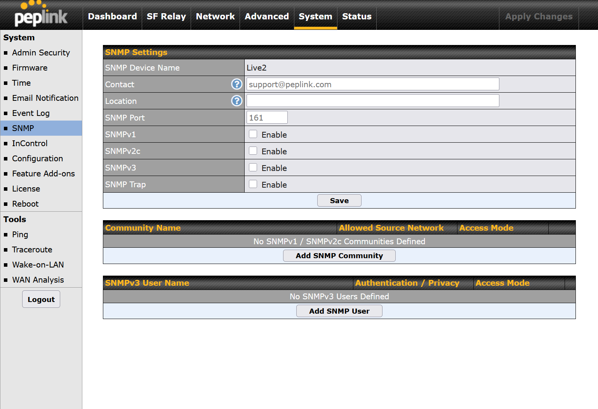
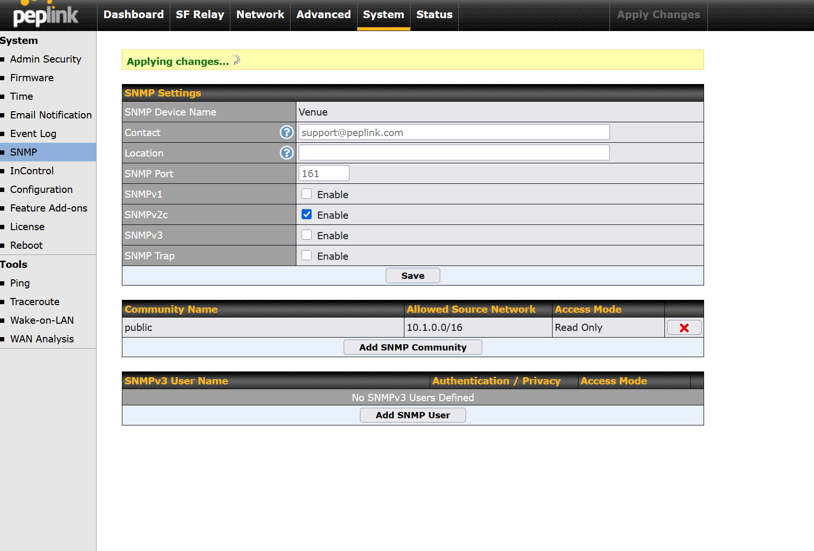

# FusionHub Virtuele Testomgeving — Setup Handleiding
**Bachelorproef Mediaventures Observability POC — maart 2026**

---

## 1. Overzicht

Virtuele testomgeving met 4 Peplink FusionHub VMs die de Mediaventures infrastructuur simuleert: centrale site (Bornem), venue, en twee live-surgery locaties. Alle VMs worden beheerd via InControl2. Op de Bornem-VM draait ook de volledige observability stack (Prometheus + Grafana + custom exporter).

---

## 2. Architectuur

```
[Internet]
    |
[Windows Host - ICS]
192.168.137.1 (Host-Only adapter)
    |
[VyOS Router]
eth0: 192.168.137.10/24  ← Host-Only (ICS)
eth1: 10.1.1.1/24        ← intnet-bornem
eth2: 10.1.2.1/24        ← intnet-venue
eth3: 10.1.3.1/24        ← intnet-surgery1
eth4: 10.1.4.1/24        ← intnet-surgery2
    |
+----------+----------+----------+----------+
|          |          |          |          |
FH-Bornem  FH-Venue  FH-Surg1  FH-Surg2
10.1.1.2  10.1.2.2  10.1.3.2  10.1.4.2

[Observability VM - AlmaLinux 9]
10.1.1.100 (intnet-bornem + bridged WiFi)
├── Prometheus          :9090
├── Grafana             :3000
├── Loki                :3100
├── Promtail            :1514/udp
├── node-exporter       :9100
├── blackbox-exporter   :9115
├── incontrol2-exporter :8080  (IC2 API + SNMP + lokale API)
└── ping-exporter       :9116

[Fysieke Peplink Balance 20X]
192.168.1.1 (WiFi: PEPLINK_2622)
└── Bereikbaar via bridged adapter op Obs. VM
```

**PepVPN topologie (gedeeltelijke mesh):**
```
Bornem ←──── Venue
  ↑             ↑
  └── Live1 ────┘
  └── Live2 ────┘
```
Elke surgery-locatie heeft een directe tunnel naar zowel Bornem als Venue. Zo kunnen videostreams rechtstreeks van surgery naar venue gaan zonder via Bornem te passeren. Bornem blijft het monitoring-eindpunt en fallback hub.

**Waarom deze opzet?**
- FusionHub ondersteunt maar 1 netwerkadapter → elke FusionHub op eigen Internal Network
- VyOS als centrale gateway met NAT en port forwarding
- Host-Only adapter + Windows ICS → stabiel IP ongeacht locatie (thuis/school)
- Geen NAT adapter: VirtualBox NAT ondersteunt geen inbound port forwarding
- Geen Bridged: IP verandert per netwerk, onbetrouwbaar voor VPN

---

## 3. IP-schema & toegang

| VM | Internal Network | IP | Gateway | Admin URL |
|----|------------------|----|---------|-----------|
| VyOS | Host-Only (ICS) | 192.168.137.10/24 | 192.168.137.1 | SSH: `vyos@192.168.137.10` |
| FH-Bornem | intnet-bornem | 10.1.1.2/24 | 10.1.1.1 | https://192.168.137.10:8441 |
| FH-Venue | intnet-venue | 10.1.2.2/24 | 10.1.2.1 | https://192.168.137.10:8442 |
| FH-Surgery1 | intnet-surgery1 | 10.1.3.2/24 | 10.1.3.1 | https://192.168.137.10:8443 |
| FH-Surgery2 | intnet-surgery2 | 10.1.4.2/24 | 10.1.4.1 | https://192.168.137.10:8444 |
| Observability VM | intnet-bornem | 10.1.1.100 | 10.1.1.1 | — |
| Grafana | (op Obs. VM) | 10.1.1.100:3000 | — | http://192.168.137.10:3000 |

DNS voor alle FusionHubs: `8.8.8.8`

### Port forwarding (VyOS DNAT)

| Poort op VyOS | Doorgestuurd naar | Dienst |
|---------------|-------------------|--------|
| :8441 | 10.1.1.2:443 | FH-Bornem webadmin |
| :8442 | 10.1.2.2:443 | FH-Venue webadmin |
| :8443 | 10.1.3.2:443 | FH-Surgery1 webadmin |
| :8444 | 10.1.4.2:443 | FH-Surgery2 webadmin |
| :3000 | 10.1.1.100:3000 | Grafana |

---

## 4. Benodigdheden

- VirtualBox 7.0+
- Vagrant
- VyOS ISO: https://vyos.net/get/nightly-builds/
- FusionHub OVA: downloaden via InControl2 → Warranty & Licenses
- 4x FusionHub evaluation licenties via InControl2 (gratis, 30 dagen geldig — opnieuw aanvragen is altijd mogelijk)

---

## 5. Stap 1 — Windows ICS instellen

1. Open VirtualBox → File → Tools → Network Manager → maak een **Host-Only adapter** aan, zet DHCP **uit**
2. Open `ncpa.cpl` (Netwerkadapters)
3. Rechtsklik op je **actieve internetadapter** (WiFi of Ethernet) → Properties → tabblad **Sharing**
4. Vink aan: *"Allow other network users to connect through this computer's Internet connection"*
5. Selecteer de zojuist aangemaakte Host-Only adapter → OK
6. De Host-Only adapter krijgt automatisch IP `192.168.137.1`

> **Let op:** Na een PC reboot of locatiewissel reset Windows ICS zichzelf. Opnieuw instellen via stap 3–5 (sharing even uit- en weer aanzetten). Werkt niet via eduroam — gebruik thuisnetwerk of mobiele hotspot.

---

## 6. Stap 2 — VyOS router opzetten

### 6.1 VM aanmaken

- Type: Linux / Debian 64-bit, RAM: 512 MB, Disk: 2 GB
- Boot van VyOS ISO, login `vyos`/`vyos`, run `install image`, reboot, ISO ontkoppelen

### 6.2 Netwerk adapters instellen via VBoxManage

VirtualBox toont standaard maar 4 adapters in de GUI — de 5e moet via command line:

```cmd
VBoxManage modifyvm "VyOS-Router" --nic1 hostonly --hostonlyadapter1 "VirtualBox Host-Only Ethernet Adapter #6"
VBoxManage modifyvm "VyOS-Router" --nic2 intnet --intnet2 "intnet-bornem"
VBoxManage modifyvm "VyOS-Router" --nic3 intnet --intnet3 "intnet-venue"
VBoxManage modifyvm "VyOS-Router" --nic4 intnet --intnet4 "intnet-surgery1"
VBoxManage modifyvm "VyOS-Router" --nic5 intnet --intnet5 "intnet-surgery2"
```

> Pas de naam van de Host-Only adapter aan naar wat bij jou van toepassing is (controleer via VirtualBox Network Manager).

### 6.3 VyOS configureren

```bash
configure

# WAN interface
set interfaces ethernet eth0 address '192.168.137.10/24'
set interfaces ethernet eth0 description 'WAN'
set protocols static route 0.0.0.0/0 next-hop '192.168.137.1'
set system name-server '8.8.8.8'

# LAN interfaces
set interfaces ethernet eth1 address '10.1.1.1/24'
set interfaces ethernet eth1 description 'Bornem'
set interfaces ethernet eth2 address '10.1.2.1/24'
set interfaces ethernet eth2 description 'Venue'
set interfaces ethernet eth3 address '10.1.3.1/24'
set interfaces ethernet eth3 description 'Surgery1'
set interfaces ethernet eth4 address '10.1.4.1/24'
set interfaces ethernet eth4 description 'Surgery2'

# NAT masquerade voor internet
set nat source rule 100 outbound-interface name 'eth0'
set nat source rule 100 source address '10.1.0.0/16'
set nat source rule 100 translation address masquerade

# Port forwarding — FusionHub webadmins
set nat destination rule 10 destination port '8441'
set nat destination rule 10 inbound-interface name 'eth0'
set nat destination rule 10 protocol 'tcp'
set nat destination rule 10 translation address '10.1.1.2'
set nat destination rule 10 translation port '443'

set nat destination rule 20 destination port '8442'
set nat destination rule 20 inbound-interface name 'eth0'
set nat destination rule 20 protocol 'tcp'
set nat destination rule 20 translation address '10.1.2.2'
set nat destination rule 20 translation port '443'

set nat destination rule 30 destination port '8443'
set nat destination rule 30 inbound-interface name 'eth0'
set nat destination rule 30 protocol 'tcp'
set nat destination rule 30 translation address '10.1.3.2'
set nat destination rule 30 translation port '443'

set nat destination rule 40 destination port '8444'
set nat destination rule 40 inbound-interface name 'eth0'
set nat destination rule 40 protocol 'tcp'
set nat destination rule 40 translation address '10.1.4.2'
set nat destination rule 40 translation port '443'

# Port forwarding — Grafana
set nat destination rule 60 description 'Grafana'
set nat destination rule 60 destination port '3000'
set nat destination rule 60 inbound-interface name 'eth0'
set nat destination rule 60 protocol 'tcp'
set nat destination rule 60 translation address '10.1.1.100'
set nat destination rule 60 translation port '3000'

# SSH toegang vanaf host
set service ssh listen-address '192.168.137.10'
set service ssh port '22'

commit
save
```

### 6.4 Testen

```bash
ping 8.8.8.8 count 3      # internet OK?
ssh vyos@192.168.137.10   # SSH vanaf host
```

---

## 7. Stap 3 — FusionHub VMs aanmaken

### 7.1 Licenties & OVA ophalen

1. Login op https://incontrol2.peplink.com
2. Ga naar **Warranty & Licenses → FusionHub Licenses**
3. Klik **Acquire FusionHub Solo License** — doe dit **4x** (gratis, 30 dagen geldig)
4. Download de **FusionHub OVA** via hetzelfde scherm

> Je kan tot 10 evaluation licenties aanvragen. Na 30 dagen gewoon opnieuw aanvragen — net voor je presentatie nieuwe licenties activeren.

### 7.2 OVA importeren en clonen

1. VirtualBox → **File → Import Appliance** → selecteer de OVA → dit wordt je base VM
2. Rechtsklik op de base VM → **Clone → Full Clone** — doe dit 4x met namen:
   - `FH-Bornem`
   - `FH-Venue`
   - `FH-Surgery1`
   - `FH-Surgery2`

### 7.3 Netwerk adapters instellen via VBoxManage

```cmd
VBoxManage modifyvm "FH-Bornem"   --nic1 intnet --intnet1 "intnet-bornem"
VBoxManage modifyvm "FH-Venue"    --nic1 intnet --intnet1 "intnet-venue"
VBoxManage modifyvm "FH-Surgery1" --nic1 intnet --intnet1 "intnet-surgery1"
VBoxManage modifyvm "FH-Surgery2" --nic1 intnet --intnet1 "intnet-surgery2"
```

### 7.4 IP instellen via console

Start elke VM — het console toont automatisch de netwerkinstellingen. Typ `setup` om te wijzigen:

| VM | IP | Subnetmask | Gateway | DNS |
|----|----|------------|---------|-----|
| FH-Bornem | 10.1.1.2 | 255.255.255.0 | 10.1.1.1 | 8.8.8.8 |
| FH-Venue | 10.1.2.2 | 255.255.255.0 | 10.1.2.1 | 8.8.8.8 |
| FH-Surgery1 | 10.1.3.2 | 255.255.255.0 | 10.1.3.1 | 8.8.8.8 |
| FH-Surgery2 | 10.1.4.2 | 255.255.255.0 | 10.1.4.1 | 8.8.8.8 |

> Na het instellen de VM **herstarten** — webadmin is daarna bereikbaar.

---

## 8. Stap 4 — FusionHub Setup Wizard & Licentie

### 8.1 Webadmin openen

Ga in browser naar (accepteer self-signed certificaat):

| URL | VM |
|-----|----|
| https://192.168.137.10:8441 | FH-Bornem |
| https://192.168.137.10:8442 | FH-Venue |
| https://192.168.137.10:8443 | FH-Surgery1 |
| https://192.168.137.10:8444 | FH-Surgery2 |

Standaard login: **admin / admin**

Na de initiële setup zijn de wachtwoorden gewijzigd:

| VM | Gebruikersnaam | Wachtwoord |
|----|----------------|------------|
| FH-Bornem | admin | Bornem12345 |
| FH-Venue | admin | Venue12345 |
| FH-Surgery1 | admin | Live112345 |
| FH-Surgery2 | admin | Live212345 |

> **Let op:** De wachtwoorden beginnen met een **hoofdletter** (Bornem12345, niet bornem12345). Dit is ook het wachtwoord dat gebruikt wordt voor de lokale API polling in `LOCAL_API_TARGETS`.

### 8.2 Setup Wizard — SpeedFusion Local ID

Bij eerste login start de wizard automatisch. Stel de Local ID in:

| VM | Local ID |
|----|----------|
| FH-Bornem | Bornem |
| FH-Venue | Venue |
| FH-Surgery1 | Live1 |
| FH-Surgery2 | Live2 |






### 8.3 Licentie activeren

**System → License** → voer de evaluation key in van InControl2.



> Het admin panel toont enkel de License pagina totdat een geldige licentie is ingevoerd. FusionHub heeft internetverbinding nodig om te activeren.

### 8.4 Licentie vernieuwen na verlopen

FusionHub evaluatielicenties verlopen na 30 dagen. Na het verlopen:
- De webadmin toont enkel nog de License pagina
- De FusionHub herstart zichzelf regelmatig, waardoor de webadmin snel wegvalt
- **Een bestaande verlopen licentie kan NIET vervangen worden** via de webadmin — het invoerveld ontbreekt

**Procedure bij verlopen licenties:**
1. Verwijder de oude FusionHub VMs uit VirtualBox (rechtsklik → Remove → Delete all files)
2. Vraag nieuwe licenties aan in InControl2 (Warranty & Licenses → Acquire FusionHub Solo License)
3. Download de FusionHub OVA opnieuw
4. Importeer de OVA, kloon 4x, configureer netwerk en IP-adressen (zie stap 3 t.e.m. stap 4)
5. Activeer de licentie **snel** na de eerste boot — de FusionHub herstart zichzelf zonder geldige licentie

> **Tip:** Vraag net voor een presentatie of deadline nieuwe licenties aan. Je kan tot 10 evaluatielicenties tegelijk hebben.

### 8.4 Resultaat

Na succesvolle activatie zijn alle 4 devices zichtbaar in InControl2:



---

## 9. Stap 5 — PepVPN tunnels configureren

De tunnels worden geconfigureerd via **InControl2** (niet via de lokale webadmin), zodat alle instellingen centraal worden beheerd en gepushed naar de devices.

### 9.1 Topologie

De gekozen topologie is een **gedeeltelijke mesh**:
- Alle devices hebben een tunnel naar **Bornem** (hub voor monitoring)
- Live1 en Live2 hebben ook een **directe tunnel naar Venue** zodat videostreams rechtstreeks van surgery naar venue gaan zonder via Bornem te passeren

```
Bornem (hub/monitoring)
  ├── tunnel → Venue
  ├── tunnel → Live1
  └── tunnel → Live2

Venue
  ├── tunnel → Bornem
  ├── tunnel → Live1
  └── tunnel → Live2
```

### 9.2 Configureren via InControl2

Er zijn **3 SpeedFusion profielen** nodig:

**Profiel 1 — Star (hub Bornem):**
1. Login op https://incontrol2.peplink.com
2. Ga naar **Network → SpeedFusion** → **Add Profile**
3. Topology: **Star**
4. Hub Device: **Bornem**
5. Hub device IP: **`10.1.1.2`** (NIET het publieke WAN-IP!)
6. Endpoint Devices: **Venue, Live1, Live2** (alle 3 selecteren)
7. Profile Name: `MediaVentures-Hub`
8. Rest standaard → Save

**Profiel 2 — Point to Point (Live1 ↔ Venue):**
1. Add Profile → Topology: **Point to Point**
2. Device A: **Live1** — Device B: **Venue**
3. Profile Name: `Live1-Venue`
4. Rest standaard → Save

**Profiel 3 — Point to Point (Live2 ↔ Venue):**
1. Add Profile → Topology: **Point to Point**
2. Device A: **Live2** — Device B: **Venue**
3. Profile Name: `Live2-Venue`
4. Rest standaard → Save

> **Let op bij virtuele omgeving:** Gebruik altijd het **interne LAN-IP** van Bornem (`10.1.1.2`) als Hub-IP, niet het publieke WAN-IP. De spokes bereiken Bornem via VyOS routing over de interne netwerken.

### 9.3 Verificatie

In InControl2 → **Network → SpeedFusion** moet elke tunnel de status **Connected** tonen. Dit is ook zichtbaar in het Grafana dashboard onder de sectie *PepVPN Tunnel Status*.

---

## 10. Stap 6 — SNMP inschakelen op FusionHubs

De observability stack gebruikt SNMP voor directe, snelle polling van de FusionHub devices. SNMP staat standaard **uitgeschakeld** en moet handmatig worden ingeschakeld op elk device.

Per FusionHub, via de webadmin:

1. Ga naar **System → SNMP**
2. Enable SNMP → aan
3. **Community string:** `public`
4. **SNMP versie:** SNMPv2c
5. Apply Changes




> **Wat is beschikbaar via SNMP op FusionHub?**
> - Uptime (`sysUpTime`)
> - Interface bytes in/out (standaard MIB-II OIDs)
> - SNMP response time (gemeten door de exporter)
>
> **Wat is NIET beschikbaar via SNMP op FusionHub?**
> - CPU-gebruik en geheugengebruik (Peplink enterprise OIDs `1.3.6.1.4.1.23695.*` worden niet ondersteund door FusionHub — enkel door fysieke Peplink-routers). Dit is een relevant verschil tussen de virtuele testomgeving en productie.

---

## 10b. Stap 6b — SNMP Allowed Network

Vul bij **Allowed Network** in: `10.1.0.0/16`

Dit dekt het volledige interne testnetwerk. De observability VM (10.1.1.100) kan dan alle FusionHubs pollen, ongeacht het subnet.

---

## 10c. Stap 6c — Syslog configureren op FusionHubs

Per FusionHub, via de webadmin:

1. Ga naar **System → Event Log → Syslog**
2. Enable syslog: **aan**
3. Server IP: **10.1.1.100**
4. Port: **1514**
5. Protocol: **UDP**
6. Apply Changes

---

## 11. Stap 7 — Observability Stack deployen

De volledige observability stack draait op een AlmaLinux 9 VM (`10.1.1.100`) op intnet-bornem. De stack wordt automatisch opgezet via Vagrant en Docker Compose.

### 11.1 Stack-bestanden

Alle bestanden staan in `poc/stack/`:

| Bestand | Functie |
|---------|---------|
| `Vagrantfile` | AlmaLinux 9 VM op 10.1.1.100, installeert Docker, start stack |
| `docker-compose.yml` | 10 containers: Prometheus, Loki, Grafana, node-exporter, incontrol2-exporter, blackbox-exporter, promtail, ping-exporter, **srt-exporter**, **srt-test-stream** |
| `Dockerfile` | Python 3.11 image voor de incontrol2-exporter |
| `Dockerfile.ping` | Python 3.11 + iputils-ping image voor de ping-jitter exporter |
| `incontrol2_exporter.py` | Custom Prometheus exporter (InControl2 API + SNMP + lokale API) |
| `ping_exporter.py` | Ping-jitter exporter (`ping -c 10 -i 0.2`) — nauwkeurige jitter via mdev |
| `prometheus.yml` | Scrape configs voor alle targets (incl. blackbox ICMP + ping jitter) |
| `blackbox.yml` | Blackbox exporter module config (ICMP probe) |
| `loki.yml` | Loki log aggregator config (30d retentie) |
| `promtail.yml` | Promtail log collector (syslog :1514, docker logs, /var/log) |
| `.env` | API credentials en SNMP config |
| `provisioning/datasources/` | Grafana datasource provisioning (Prometheus + Loki) |
| `provisioning/dashboards/` | Grafana dashboard JSON auto-provisioning |
| `provisioning/alerting/` | Grafana alert rules provisioning (9 regels) |

### 11.2 .env configureren

Maak/controleer het bestand `poc/stack/.env`:

```env
IC_CLIENT_ID=<jouw_client_id>
IC_CLIENT_SECRET=<jouw_client_secret>
IC_ORG_ID=a1pokv
IC_GROUP_ID=4
POLL_INTERVAL=15
EXPORTER_PORT=8080
SNMP_ENABLED=true
SNMP_COMMUNITY=public
SNMP_TARGETS=Bornem:10.1.1.2,Venue:10.1.2.2,Live1:10.1.3.2,Live2:10.1.4.2,Balance20X:192.168.1.1
LOCAL_API_TARGETS=Balance20X:192.168.1.1:Balance20x,Bornem:10.1.1.2:Bornem12345,Venue:10.1.2.2:Venue12345,Live1:10.1.3.2:Live112345,Live2:10.1.4.2:Live212345
```

> - De InControl2 API credentials zijn te vinden via InControl2 → **System → API**. De `IC_GROUP_ID` is `4` (MediaVentures groep).
> - `SNMP_TARGETS`: FusionHub LAN IPs (`.2`), niet de VyOS gateway IPs (`.1`). Inclusief fysieke Balance20X indien aangesloten.
> - `LOCAL_API_TARGETS`: Format `naam:ip:wachtwoord`. De exporter pollt `status.cpu` (CPU load) en `status.ap` (WiFi AP status) via de lokale Peplink REST API.

### 11.3 Stack deployen

```bash
cd poc/stack
vagrant up
```

Vagrant doet automatisch:
1. AlmaLinux 9 VM aanmaken op intnet-bornem (10.1.1.100)
2. VyOS instellen als default gateway
3. Docker installeren
4. Stack-bestanden kopiëren naar `/opt/observability/`
5. `docker compose up -d --build` uitvoeren

### 11.4 Stack bijwerken na codewijzigingen

De Vagrantfile synct bestanden niet automatisch. Gebruik SCP + SSH:

```bash
# Bestanden uploaden naar de VM
KEY="poc/stack/.vagrant/machines/default/virtualbox/private_key"

scp -i "$KEY" -P 2222 -o StrictHostKeyChecking=no -o PubkeyAcceptedKeyTypes=+ssh-rsa \
  poc/stack/incontrol2_exporter.py \
  poc/stack/.env \
  vagrant@127.0.0.1:/opt/observability/

scp -i "$KEY" -P 2222 -o StrictHostKeyChecking=no -o PubkeyAcceptedKeyTypes=+ssh-rsa \
  poc/stack/provisioning/dashboards/peplink.json \
  vagrant@127.0.0.1:/opt/observability/provisioning/dashboards/

# incontrol2-exporter herbouwen
ssh -i "$KEY" -p 2222 -o StrictHostKeyChecking=no -o PubkeyAcceptedKeyTypes=+ssh-rsa \
  vagrant@127.0.0.1 \
  "cd /opt/observability && docker compose up -d --build incontrol2-exporter"

# ping-exporter deployen (nieuwe container voor jitter meting)
scp -i "$KEY" -P 2222 -o StrictHostKeyChecking=no -o PubkeyAcceptedKeyTypes=+ssh-rsa \
  poc/stack/ping_exporter.py poc/stack/Dockerfile.ping \
  vagrant@127.0.0.1:/opt/observability/
ssh -i "$KEY" -p 2222 -o StrictHostKeyChecking=no -o PubkeyAcceptedKeyTypes=+ssh-rsa \
  vagrant@127.0.0.1 \
  "cd /opt/observability && docker compose up -d --build ping-exporter"
```

### 11.5 Architectuurkeuzes en bevindingen

**SNMP pysnmp versie — kritieke compatibiliteitsbevinding**

pysnmp v7+ (standaard geïnstalleerd via pip) heeft een volledig nieuwe async API en is **niet** compatibel met de synchrone `getCmd`/`nextCmd` stijl die de exporter gebruikt. Ook pysnmp v6.x bleek gebroken. Na testen bleek enkel versie `4.4.12` correct te werken:

```dockerfile
RUN pip install prometheus_client requests pysnmp==4.4.12 pyasn1==0.4.8
```

Dit is bewust gepind in de `Dockerfile`. Upgraden naar een nieuwere versie vereist een volledige herschrijving van de SNMP-code naar de async API.

**network_mode: host voor de exporter container**

De `incontrol2-exporter` container draait met `network_mode: host` in plaats van de standaard Docker bridge network. Dit was noodzakelijk omdat de exporter directe SNMP-verbindingen moet opzetten naar de FusionHub IPs (10.1.x.2) die enkel bereikbaar zijn via de VM's netwerk interface. Vanuit een Docker bridge network zijn deze interne IPs niet bereikbaar.

Als gevolg hiervan communiceert Prometheus met de exporter via het VM-IP (`10.1.1.100:8080`) in plaats van via de container naam:

```yaml
# prometheus.yml
- job_name: 'incontrol2'
  static_configs:
    - targets: ['10.1.1.100:8080']  # niet 'incontrol2-exporter:8080'
```

**Statische routes op de Observability VM**

De Observability VM staat op intnet-bornem (10.1.1.100) en kan standaard alleen hosts op het eigen subnet (10.1.1.0/24) bereiken. Om de FusionHubs op andere subnetten (Venue 10.1.2.2, Live1 10.1.3.2, Live2 10.1.4.2) te bereiken via ICMP, SNMP en de lokale API, moeten statische routes worden toegevoegd via VyOS als gateway:

```bash
sudo ip route add 10.1.2.0/24 via 10.1.1.1 dev eth1
sudo ip route add 10.1.3.0/24 via 10.1.1.1 dev eth1
sudo ip route add 10.1.4.0/24 via 10.1.1.1 dev eth1
```

Om deze routes persistent te maken (overleven een reboot):

```bash
echo '10.1.2.0/24 via 10.1.1.1 dev eth1
10.1.3.0/24 via 10.1.1.1 dev eth1
10.1.4.0/24 via 10.1.1.1 dev eth1' | sudo tee /etc/sysconfig/network-scripts/route-eth1
```

Zonder deze routes tonen Venue, Live1 en Live2 **ICMP DOWN** in het Grafana dashboard, terwijl Bornem en Balance20X (via bridged adapter) wel bereikbaar zijn.

**VyOS source NAT voor Grafana port forwarding**

Bij het port forwarden van Grafana (poort 3000) via VyOS naar de Observability VM (10.1.1.100) kan het return traffic niet correct terugkomen bij de Windows host. Dit wordt opgelost met een extra source NAT masquerade regel op het eth1 (Bornem) interface:

```bash
configure
set nat source rule 200 outbound-interface name 'eth1'
set nat source rule 200 source address '192.168.137.0/24'
set nat source rule 200 translation address 'masquerade'
commit
save
```

Zonder deze regel is Grafana niet bereikbaar via http://192.168.137.10:3000 vanuit de Windows host.

**FusionHub CPU/geheugen via SNMP niet beschikbaar**

Peplink enterprise SNMP OIDs (`1.3.6.1.4.1.23695.200.*`) voor CPU en geheugen worden door FusionHub **niet** ondersteund. Ze zijn enkel beschikbaar op fysieke Peplink routers (20X, 380X). Dit is een relevant verschil tussen de virtuele testomgeving en de productieomgeving bij Mediaventures.

**NAT-traversal — scope-afbakening**

De PoC valideert **geen echte site-to-site NAT-traversal**. In de virtuele testomgeving hebben alle FusionHubs directe routeerbare IP-adressen (10.1.x.2) en bereiken ze elkaar via VyOS-routing — er zit geen NAT tussen de spokes. In een productieomgeving staat elk Peplink-device typisch achter een ISP-NAT-router (CGNAT, dubbele NAT bij klanten). PepVPN gebruikt daarvoor NAT-T (NAT traversal via UDP 4500 + keepalives) om tunnels te onderhouden door NAT-staten heen.

De tunnel-UP/DOWN-monitoring en alle bijbehorende alert-regels zijn gevalideerd op directe verbindingen. De verwachting is dat de InControl2 API-metrics (`peplink_tunnel_up`) identiek zijn achter NAT — dat is een ingebouwde Peplink-guarantee — maar dit is binnen de PoC-scope niet experimenteel bevestigd.

**Implicaties voor productie:**
- NAT rebinding (ISP wisselt external port) kan een korte tunnelonderbreking veroorzaken die als flap zichtbaar is in de `peplink_tunnel_up` timeseries. De alerting-drempel van 1 minuut absorbeert kortdurende flaps.
- Bij CGNAT (meerdere klanten op één publiek IP) werkt PepVPN via SpeedFusion's eigen hole-punching via de Peplink fusionhub.net relay — dit pad is qua monitoringgedrag identiek aan directe NAT-T.
- De observability stack hoeft voor NAT-T geen aanpassing: de metrics komen via de InControl2 cloud API of via directe SNMP/API op het LAN-adres — NAT beïnvloedt dit pad niet.

**Waarom niet getest in de PoC:** VirtualBox NAT-adapter ondersteunt geen inbound verkeer (vereist voor PepVPN UDP 4500); de gekozen ICS + Host-Only + VyOS-topologie geeft stabiele directe routering die reproduceerbaar is ongeacht locatie. Het toevoegen van een extra NAT-laag (bijv. dubbele VyOS + NAT voor spokes) viel buiten de tijdsbudget en had geen meerwaarde voor de kernvraag: bewijs dat de observability stack alle relevante Peplink-metrics zichtbaar maakt en alerts correct genereert.

### 11.6 Verzamelde metrics — overzicht

| Metric | Bron | Beschrijving |
|--------|------|-------------|
| **InControl2 API** | | |
| `peplink_device_online` | InControl2 API | Online (1) / offline (0) per device |
| `peplink_device_uptime_seconds` | InControl2 API | Uptime in seconden |
| `peplink_device_client_count` | InControl2 API | Aantal verbonden clients |
| `peplink_device_tx_bytes` | InControl2 API | Verzonden bytes |
| `peplink_device_rx_bytes` | InControl2 API | Ontvangen bytes |
| `peplink_tunnel_up` | InControl2 API | PepVPN tunnels gezond (1=ok, 0=fout) |
| `peplink_recent_event_count` | InControl2 API | Aantal events in laatste event log respons |
| **SNMP MIB-II (alle devices)** | | |
| `peplink_snmp_reachable` | SNMP direct | Device bereikbaar via SNMP (1/0) |
| `peplink_snmp_uptime_seconds` | SNMP direct | Uptime via SNMP |
| `peplink_snmp_response_ms` | SNMP direct | SNMP response tijd in ms |
| `peplink_snmp_interface_in_bytes` | SNMP direct | Interface RX bytes (per interface) |
| `peplink_snmp_interface_out_bytes` | SNMP direct | Interface TX bytes (per interface) |
| **SNMP Enterprise (enkel fysieke hardware)** | | |
| `peplink_snmp_wan_status` | SNMP enterprise | WAN status (1=disabled, 2=disconnected, 3=connected) |
| `peplink_snmp_wan_link_up` | SNMP enterprise | WAN link up (1) / down (0) per interface |
| `peplink_snmp_wan_signal_dbm` | SNMP enterprise | Signaalsterkte in dBm (cellular/WiFi WAN) |
| `peplink_snmp_wan_healthcheck` | SNMP enterprise | Health check status per WAN interface |
| `peplink_snmp_wifi_client_count` | SNMP enterprise | WiFi clients verbonden per SSID |
| **Lokale API (via web admin)** | | |
| `peplink_local_cpu_load_percent` | Lokale API | CPU-gebruik in % via `status.cpu` |
| `peplink_local_ap_up` | Lokale API | WiFi AP aan (1) / uit (0) via `status.ap` |
| `peplink_local_api_reachable` | Lokale API | Lokale API bereikbaar (1/0) |
| **ICMP Probes** | | |
| `probe_success` | Blackbox ICMP | Site bereikbaar (1) / onbereikbaar (0) |
| `probe_icmp_duration_seconds{phase="rtt"}` | Blackbox ICMP | Round-trip time in seconden |
| `ping_jitter_ms` | Ping exporter | Jitter (mdev van 10 pings) in ms |
| `ping_rtt_avg_ms` | Ping exporter | Gemiddelde RTT in ms |
| `ping_packet_loss_percent` | Ping exporter | Packet loss percentage |
| **Logs** | | |
| FusionHub/Peplink syslog | Loki (via Promtail) | Apparaatgebeurtenissen in Grafana Logs |
| Docker container logs | Loki (via Promtail) | Stack-interne logs |
| **Exporter intern** | | |
| `peplink_scrape_duration_seconds` | Exporter | Duur van de volledige scrape-cyclus |
| `peplink_scrape_success` | Exporter | Laatste scrape succesvol (1/0) |
| `peplink_api_errors_total` | Exporter | Teller API-fouten per endpoint |
| `peplink_snmp_errors_total` | Exporter | Teller SNMP-fouten per device |
| `peplink_local_api_errors_total` | Exporter | Teller lokale API-fouten per device |

---

## 12. Stap 8 — FusionHub syslog configureren (optioneel)

Om apparaatberichten in het Grafana log panel te zien, moet syslog worden ingeschakeld op elke FusionHub:

1. Ga naar de webadmin van de FusionHub (zie IP-schema)
2. **System → System Logging**
3. Syslog: **aan**
4. Syslog Server: `10.1.1.100`
5. Port: `1514`
6. Protocol: **UDP**
7. Log Level: **Informational**
8. Klik **Apply Changes**

Herhaal voor alle 4 FusionHubs. Logs verschijnen daarna in het Grafana dashboard onder "Systeemlogboek".

---

## 13. Verificatie checklist

| Check | Hoe | Verwacht resultaat |
|-------|-----|--------------------|
| VyOS internet | `ping 8.8.8.8 count 3` op VyOS | 3 replies |
| FH-Bornem webadmin | https://192.168.137.10:8441 | Login scherm |
| FH-Venue webadmin | https://192.168.137.10:8442 | Login scherm |
| FH-Surgery1 webadmin | https://192.168.137.10:8443 | Login scherm |
| FH-Surgery2 webadmin | https://192.168.137.10:8444 | Login scherm |
| PepVPN tunnels | InControl2 → SpeedFusion | Alle tunnels Connected |
| Exporter metrics | `curl http://10.1.1.100:8080/metrics` (vanuit VM) | `peplink_device_online` zichtbaar |
| Blackbox probe | `curl "http://10.1.1.100:9115/probe?target=10.1.1.2&module=icmp"` | `probe_success 1` |
| Loki health | `curl http://10.1.1.100:3100/ready` | `ready` |
| Prometheus targets | http://192.168.137.10:9090/targets | 8 targets UP |
| Grafana dashboard | http://192.168.137.10:3000 (admin/admin) | "Mediaventures — Observability Dashboard" met data |
| SNMP reachability | Grafana → SNMP sectie | Alle 5 devices REACHABLE |
| Enterprise SNMP | Grafana → WAN Multi-Link sectie | Balance20X WAN status, link, signaal |
| Lokale API | Grafana → Device Health sectie | Balance20X CPU load, AP status |
| Tunnel status | Grafana → PepVPN Tunnels sectie | Alle tunnels UP |
| ICMP latency | Grafana → Connectiviteit sectie | RTT < 10ms (lokale VM) |
| Alert rules | Grafana → Alerting → Alert rules | 9 regels zichtbaar |
| InControl2 | Devices overzicht | 4 devices ONLINE |

---

## 14. Troubleshooting

| Probleem | Oplossing |
|----------|-----------|
| Geen internet na reboot of locatiewissel | Windows ICS reset zichzelf — opnieuw instellen via `ncpa.cpl` (sharing uit en weer aan) |
| Werkt niet op school (eduroam) | Eduroam blokkeert poorten — gebruik thuisnetwerk of mobiele hotspot |
| Webadmin niet bereikbaar | Herstart de FusionHub VM — lost het meestal op |
| Webadmin nog steeds niet bereikbaar | Check adapter in VirtualBox: Internal Network + juiste naam? |
| Licentie toont "Expired 1970-01-01" | NTP sync mislukt — reboot via InControl2, tijd synchroniseert automatisch |
| Licentie activatie mislukt | FusionHub heeft internet nodig — check WAN Connected op dashboard |
| PepVPN stuck op Connecting | Controleer of remote IP `10.1.1.2` is (niet het publieke WAN-IP) en of pre-shared keys overeenkomen |
| SSH naar VyOS werkt niet | `configure` → `set service ssh listen-address 192.168.137.10` → `commit` `save` |
| SNMP UNREACHABLE in Grafana | Controleer of SNMP ingeschakeld is op de FusionHub (System → SNMP) en of `network_mode: host` actief is in docker-compose.yml |
| SNMP werkt niet na pysnmp update | pysnmp v5+ heeft een andere API — pin versie in Dockerfile: `pysnmp==4.4.12 pyasn1==0.4.8` |
| Prometheus target incontrol2 DOWN | Check of target in prometheus.yml `10.1.1.100:8080` is (niet de container naam) — vereist vanwege `network_mode: host` |
| Grafana toont "No data" voor tunnels | Tunnels moeten eerst configured en connected zijn in InControl2 voordat `peplink_tunnel_up` data heeft |
| CPU Usage panel leeg in Grafana | Normaal — FusionHub ondersteunt geen Peplink enterprise SNMP OIDs voor CPU/geheugen, enkel bij fysieke routers |
| Exporter logs: `'list' object has no attribute 'get'` | tunnel_stat API geeft list terug (meerdere tunnels) — verouderde exporter versie, update naar huidige `incontrol2_exporter.py` |
| Blackbox probe_success = 0 voor alle sites | Controleer `network_mode: host` op blackbox-exporter container |
| ping_jitter_ms "No data" in Grafana | Ping-exporter nog niet gebuild: `docker compose up -d --build ping-exporter` |
| ping-exporter crasht | Controleer `cap_add: NET_RAW` in docker-compose.yml (vereist voor raw sockets) |
| Loki "ingester not ready" | Normaal na opstart — wacht 15s |
| Grafana log panels tonen "No data" | Syslog nog niet geconfigureerd op FusionHub — zie stap 8 |
| Alert fires "Exporter Down" na herstart | Normaal bij eerste scrape — alert lost zichzelf op na 2 min |
| Email alerts falen (SMTP error) | Verwacht in POC — SMTP niet geconfigureerd. Alerts zijn wel zichtbaar in Grafana UI |

---

## Fysieke Peplink — Balance 20X

Naast de virtuele FusionHub-omgeving is er ook een fysieke Peplink Balance 20X beschikbaar voor testen.

| Parameter | Waarde |
|-----------|--------|
| Model | Peplink Balance 20X |
| Firmware | 8.5.1 build 5531 |
| Web admin | `https://192.168.1.1` |
| Login | `admin` / `Balance20x` |
| WiFi SSID | `PEPLINK_2622` (2.4 GHz) |
| SSID wachtwoord | `fysiekepep` |
| LAN subnet | `192.168.1.0/24` |

**Aansluiting:** Verbind een ethernetkabel van een LAN-poort van de bestaande router naar de **WAN-poort** van de Balance 20X (niet LAN, anders IP-conflict). Verbind via WiFi met `PEPLINK_2622` en surf naar `https://192.168.1.1`.

> **Let op — IP-conflict met thuisrouter:** De Balance 20X gebruikt standaard `192.168.1.1` als LAN-IP. Veel thuisrouters (ook het appartement) gebruiken hetzelfde `192.168.1.1`. Dit veroorzaakt een routingconflict: je browser weet niet of `192.168.1.1` de Peplink of de thuisrouter is.
>
> **Oplossing — doe dit vóór je de WAN-kabel insteekt:**
> 1. Verbind via WiFi met `PEPLINK_2622` (wachtwoord: `fysiekepep`)
> 2. Surf naar `https://192.168.1.1` → login (`admin` / `Balance20x`)
> 3. Ga naar **Network → LAN** → verander LAN IP van `192.168.1.1` naar bijv. **`192.168.2.1`**
> 4. Pas ook het DHCP-bereik aan naar `192.168.2.x`
> 5. Sla op → het device herstart met het nieuwe IP
> 6. Opnieuw verbinden via WiFi → surf naar `https://192.168.2.1`
> 7. Steek daarna pas de WAN-kabel in de thuisrouter
>
> Na deze stap is de Balance 20X bereikbaar op `192.168.2.1` en is er geen conflict meer.

### Waarom een fysieke Peplink? (Live3 hybride-validatie)

FusionHub (virtueel) heeft twee structurele beperkingen die op fysieke hardware **niet** bestaan:

1. **Peplink enterprise SNMP OIDs** (`1.3.6.1.4.1.23695.*`) voor gedetailleerde WAN-status, WiFi clients, signal strength → op FusionHub niet beschikbaar, op Balance 20X wél.
2. **Lokale REST API** (`/cgi-bin/MANGA/api.cgi`) met `status.cpu` en `status.ap` → FusionHub antwoordt met "unknown function", Balance 20X levert deze datapunten rechtstreeks.

De fysieke Balance 20X is in de PoC opgenomen als **Live3 — hybride fysiek↔virtueel spoke**. Het toestel vormt een P2P PepVPN-tunnel (`Bornem-Live3`) met FH-Bornem en fungeert zo als een vijfde volwaardige site in de topologie. Deze keuze levert twee bewijsdoelen tegelijk:

1. **Observability-dekking op fysieke hardware** — alle metrics (ICMP, SNMP MIB-II, enterprise SNMP, lokale API, ping-jitter, Loki syslog) worden in dezelfde dashboard-secties en met dezelfde alert-regels gevalideerd tegen een fysiek toestel. Als de stack virtueel én fysiek werkt zonder aparte code-paden, dekt hij het volledige Peplink-spectrum.
2. **Hybride PepVPN-validatie** — de tunnel tussen een virtuele FusionHub-hub en een fysieke Balance 20X-spoke reproduceert de realistische productiesituatie bij Mediaventures, waar SpeedFusion-tunnels tussen FusionHub-cloud en fysieke veldunits lopen. Tunnel-down scenario's, tc netem latency-injecties en packet-loss tests kunnen rechtstreeks tegen Live3 worden uitgevoerd en bewijzen dat de observability stack fysiek↔virtueel identiek reageert.

Live3 wordt **buiten het bestaande `MediaVentures-Hub` Star-profiel** gehouden en bereikt de observability stack via **WiFi-direct** (192.168.1.1 op de bridged adapter van de obs VM). Er is geen actieve PepVPN-tunnel tussen Balance 20X en FH-Bornem — de tunnelpoging is op 16 april 2026 opgegeven (zie scopeverantwoording hieronder).

> **Scopeverantwoording voor poc.tex:** de 4 FusionHub-VMs modelleren de productie-topologie (Bornem-hub, Venue-mixing, Live1/Live2-spokes) en vormen een **symmetrische, reproduceerbare** testomgeving voor tunnel- en site-scenario's. De Balance 20X is als Live3 toegevoegd om expliciet te bewijzen dat de observability stack werkt op fysieke Peplink-hardware — met metrics die FusionHub niet biedt (enterprise SNMP WAN/WiFi, lokale REST API CPU). De 4 FusionHub PepVPN-profielen (Bornem-star + 2 P2P) leveren het bewijs voor tunnel-monitoring; de Balance 20X levert het bewijs voor fysieke hardware-observability. Beide bewijsdoelen zijn gedekt zonder dat een werkende Balance 20X↔FusionHub-tunnel vereist is.
>
> **PrimeCare-voetnoot:** PrimeCare verlopen → InControl2 rapporteert device_online=0 voor Balance 20X, terwijl SNMP/lokale API/ICMP normaal werken. Dit mismatch-patroon is zelf een argument voor de multi-bron aanpak: geen enkele single-source monitoring had hier het correcte beeld gegeven.
>
> **PepVPN-tunnel Balance 20X — opgegeven 16 april 2026:** Een P2P-profiel `Bornem-Live3` was aangemaakt in IC2 maar de tunnel bleef steken in een auth-cyclus (PSK correct, maar FH-Bornem-profiel IC2-locked en niet debugbaar). Na meerdere pogingen is de tunnel-aanpak opgegeven wegens deadline-druk en marginale meerwaarde bovenop de 4 werkende FusionHub-tunnels. De Balance 20X is daarna overgeschakeld naar WiFi-direct monitoring. Zie ook LIVE3-DEPLOY-NOTES.md.
>
> **Syslog-limitatie (open):** zonder werkende PepVPN-tunnel is syslog van de Balance 20X locatie-afhankelijk (bridged WiFi-IP van obs VM — DHCP). Zie Stap 2 Syslog forwarding hieronder voor details.

### Setup-stappen fysieke Balance 20X

#### Stap 1 — SNMP inschakelen

1. Surf naar `https://192.168.1.1` → login
2. Ga naar **System → SNMP**
3. Zet SNMP **aan** (SNMPv2c)
4. Community string: `public` (of naar keuze — noteer wat je kiest)
5. Sla op en test met: `snmpwalk -v2c -c public 192.168.1.1 1.3.6.1.4.1.23695` (vanop een verbonden apparaat)

**Doel:** Valideren welke Peplink enterprise OIDs beschikbaar zijn op fysieke hardware.
**Resultaat:** Zie `poc/snmp_fysieke_peplink.md` — 200+ enterprise OIDs gevonden (WAN status, bandwidth, WiFi AP). CPU/geheugen OIDs niet beschikbaar op dit model.

#### Stap 2 — Syslog forwarding instellen ⚠️ (gedocumenteerde limitatie)

1. Ga naar `https://192.168.1.1` → **System → Event Log**
2. Stel een **Remote Syslog Server** in
   - IP: bridged IP van de observability VM (controleer via `ip -4 addr show eth2` op de obs VM)
   - Poort: `1514` (UDP — Promtail luistert op 1514)
3. Sla op → "Changes Applied"

**Resultaat:** Syslog berichten van `balance-2622` komen binnen via de bridged WiFi-adapter (`eth2`) van de obs VM en worden door Promtail naar Loki gestuurd.

> **Bekende limitatie — locatie-afhankelijk syslog-IP:**
> De obs VM ontvangt syslog via haar bridged WiFi-adapter (`eth2`), die een DHCP-adres krijgt van het lokale WiFi-netwerk. Dit IP verandert per locatie (thuis, school, hotspot). De Balance 20X moet telkens handmatig naar het nieuwe IP worden geconfigureerd als de laptop van netwerk wisselt.
>
> **Oorsprong:** Er was een plan om de PepVPN-tunnel `Bornem-Live3` op te zetten zodat syslog via `10.1.1.100:1514` (tunnel-IP, locatie-onafhankelijk) kon worden verstuurd. Die tunnel is op 16 april 2026 opgegeven wegens PrimeCare-beperkingen (zie sectie 11.5 en de scopeverantwoording). Daarmee blijft de locatie-afhankelijkheid van het syslog-IP een openstaande limitatie.
>
> **Impact in productie:** In een echte productieomgeving heeft de obs-server een vast IP (statisch of via PepVPN-tunnel). Dit probleem is dus PoC-specifiek en geen structureel obstakel voor uitrol.

#### Stap 3 — InControl2 registratie ✅

1. Ga naar **System → InControl2** (of **Cloud Management**)
2. Zorg dat InControl2 management **ingeschakeld** is
3. Het toestel verschijnt in je bestaande organisatie (`a1pokv`) of registreer het handmatig via serienummer
4. Voeg het toe aan groep `MediaVentures` (group ID 4)

**Resultaat (14 april 2026):** Balance 20X verschijnt in InControl2 als `Balance_2622` met device_id=25. `peplink_device_online` rapporteert echter `0` ondanks dat het device bereikbaar is.

> **Bekende limitatie — PrimeCare verlopen:** De PrimeCare-licentie van de Balance 20X is verlopen. Dit beperkt de InControl2 API-data voor dit device (device_online=0 ondanks werkende verbinding). SNMP, lokale REST API en ICMP werken ongehinderd verder. Dit illustreert de **meerwaarde van de multi-bron aanpak**: zelfs als één databron (IC2 API) wegvalt door een licentiekwestie, blijven de overige drie databronnen volledig operationeel. Zie bap-schrijfpunten in MEMORY.md.

**Doel:** De incontrol2-exporter kan dan ook deze fysieke device monitoren via de API.

#### Stap 4 — Lokale REST API verkennen ✅

**Endpoint:** `POST https://192.168.1.1/cgi-bin/MANGA/api.cgi`
**Auth:** Cookie-based login met `{"func": "login", "username": "admin", "password": "Balance20x"}`

**Resultaat:** Na exhaustieve brute-force test (9 prefixes × 80+ subjects = ~720 combinaties) zijn de werkende functies geïdentificeerd.

| Functie | FusionHub | Balance 20X | Data |
|---------|-----------|-------------|------|
| `config.wan` | **OK** | **OK** | WAN interfaces configuratie |
| `config.lan` | **OK** | **OK** | LAN/VLAN/DHCP configuratie |
| `config.firewall` | **OK** | **OK** | Firewall regels |
| `config.pepvpn` | **OK** | **OK** | PepVPN configuratie |
| `config.dns` | **OK** | **OK** | DNS instellingen |
| `config.admin` | **OK** | **OK** | Admin instellingen |
| `config.ntp` | **OK** | **OK** | NTP synchronisatie |
| `config.dhcp` | FAIL | **OK** | DHCP server config |
| `status.cpu` | **OK** | **OK** | **Live CPU load** (`{"cpu": {"load": "1.00%"}}`) |
| `status.log` | **OK** | **OK** | Event log entries |
| `status.ap` | FAIL | **OK** | WiFi AP info (SSID, kanaal, BSSID) |
| `status.openvpn` | **OK** | **OK** | `{"support": true}` |
| `status.ospf` | **OK** | **OK** | OSPF area's en interfaces |
| `status.wan.*` | FAIL | FAIL | WAN status niet beschikbaar |
| `status.pepvpn` | FAIL | FAIL | VPN tunnel status niet via API |
| `status.client` | FAIL | FAIL | Client lijst niet via API |
| `status.memory` | FAIL | FAIL | Geheugen niet via API |

**Conclusie:** De lokale API biedt **beperkte maar waardevolle real-time data**:
- **`status.cpu`** — live CPU-load op beide platformen — geïntegreerd in de exporter als `peplink_local_cpu_load_percent`
- **`status.ap`** — WiFi AP status op fysieke hardware — geïntegreerd als `peplink_local_ap_up`
- De meerderheid van `status.*` functies (WAN, VPN, clients, throughput, memory) zijn niet beschikbaar via de lokale API.

Zie `poc/snmp_fysieke_peplink.md` voor het volledige API-vergelijkingsoverzicht.

#### Stap 5 — (Optioneel) PepVPN tunnel opzetten

Als de Balance 20X in hetzelfde netwerk zit als de virtuele omgeving, kan een PepVPN-tunnel opgezet worden naar een FusionHub om end-to-end tunnelmonitoring te testen met echte hardware aan één kant.

---

## Gerelateerde documentatie

| Document | Inhoud |
|----------|--------|
| `poc/blackbox_exporter.md` | Bereikbaarheid, RTT en packet loss via ICMP probes (blackbox exporter) |
| `poc/ping_exporter.md` | Nauwkeurige jitter via `ping -c 10 -i 0.2` (ping-jitter exporter) |
| `poc/loki_logging.md` | Log aggregatie met Loki en Promtail |
| `poc/alerting.md` | Grafana alert rules en notificaties |
| `poc/dashboard.md` | Dashboard secties en handleiding |
| `poc/testscenarios.md` | Validatiescenario's met tc netem simulaties |
| `poc/datadiscovery_incontrol.md` | InControl2 API discovery resultaten |
| `poc/snmp_fysieke_peplink.md` | SNMP discovery op fysieke Balance 20X (enterprise OIDs) |

---

*Documentatie bijgewerkt — maart 2026*
